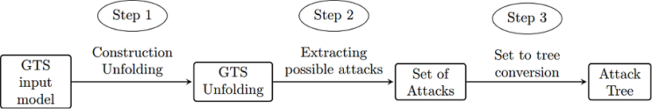

# Project README

This repository contains the implementation and evaluation of a Master Thesis on the topic of Automated Attack Tree Generation by Unfoldindg a Graph Transformation System. This Thesis was written by by David Huistra for the [FMT Research Group](http://fmt.cs.utwente.nl/) 

## The Implementation
This works implementation is developed as an extension module of [GROOVE](http://groove.cs.utwente.nl/). The process of this extension module, as shown in the figure bellow, unfolds a given GTS, identifies all sequences of rule applications that result in the goal condition being satisfied and (optionally) constructs an attack tree that describes all these sequences.

The approach was developed for the security domain, where it is used to construct an attack tree for the model of an organization by identifying all possible attacks from the model.

### Unfolding implementation
The main contribution of the implementation is a (basic) implementation for the unfolding of a Graph Transformation System. The unfolding of a GTS is a acyclic branching structure describing all the possible computations of the original system.

The main limitations of the implementation:
* Only supports acyclic finite-state GTS
* Unfolding only implemented for (creation and deletion of) edges.
* Does not support negative application condition
 
### Tree construction
In additoin of the unfolding constuction, the approach also contains a implementation to obtain all possible routes to the goal condition and convert this information into an (attack) tree. This implementation contains optional steps to reduce the size of the produced the tree.

### Instructions

The entire approach can be executed by running UnfoldingMain.java found in the 
/Implementation/src/groove/unfolding folder and giving the filepath of a GTS as argument.

A GTS can be constructed in Groove through its Simulator, e.g. /Implementation/src/groove/Simulator.java

## The Evaluation
This project was evaluated in two manners. The first is a quatitative evaluation focusing on the scalability of the approach, specifically the performance of the approach for identifying possible attacks in a given model. The second part was a qualitative evaluation where the approach was used on an existing case study. 

All models used in the evaluation of the approach can be found in the Evaluation folder. The models can be loaded into GROOVE for visualisation and inter-action.